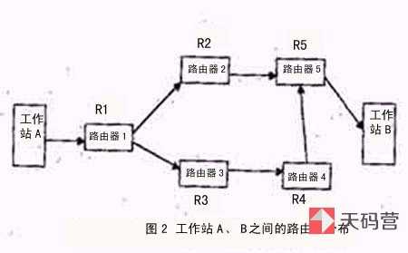
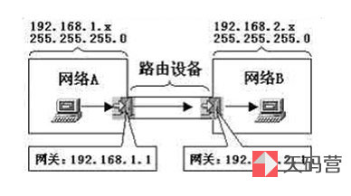

[集线器](https://www.tianmaying.com/tutorial/NetWorkInstrument)

## 集线器

### 工作原理

以**广播方式**发送，把**数据包**发送到集线器相连的所有节点。属于**物理层**的基础设备，不做数据交换，也没有**交换机所具有的 MAC 地址表**

### 优缺点：

优点：

- **连接多个不同的局域网**，将这些集中到单一的设备商来，并且让这个设备来负责连通这些链接的位置。集线器是一个集中式、广播式的中继设备，能够接受两端不同的信号，并且将信号复制、信号后传送到相对的另一端。

缺点：

- 不具备交换功能
- 只是简单地将数据包复制并放大后，送到目前连接该集线器地各县设备商，因此数据包充斥在整个连通地局域网中，同时只有一组数据交换的信号，所以在数据包传输量较大的居于网中，集线器将无法有效地传输数据，因此可能会同时传送多份数据，从而造成数据包的冲突问题增加。

## 网桥 Bridge

### 功能概述

将两个相似的网络连接起来，并对网络数据的流通进行管理。位于**数据链路层**，不仅能扩展网络的距离或范围，而且能提高网络的性能、可靠性和安全性。利用网桥隔断的信息可以隔离出安全网段，防止其他网段内的用户非法访问。

### 工作原理

- 作为中继器对所接受的信号进行放大，然后直接发送到另一个端口连接的电缆上。主要用于扩展网络的物理连接范围；
- 对 MAC 地址进行分区，隔离不同物理网段之间的碰撞。
- 集线器和中继器都是物理层的设备，而网桥属于二层设备

### 优缺点

优点：

- 过滤通信量。网桥可以使用局域网的一个网段上各工作站的信息量局限在本网段的范围内，而不会经过网桥留到其他网段去。

- 扩大了物理范围

- 可使用不同的物理层，可互连不同的局域网

- 提高了可靠性。如果把较大的局域网分割成若干较小的局域网，并且每个局域网内部的信息量明显地高于网间的信息量，那么整个互连网络的性能就变得更好

缺点：

- 由于网桥对接的帧要先存储和查找站表，然后转发，增加了时延

- MAC 子层没有流量控制功能。当网络负荷很重的时候，可能因网桥缓冲区的存储空间不够而发生溢出，以致产生帧丢失的现象。

- 具有不同 MAC 子层的网段桥接在一起，网桥在转发一个帧之前，必须修改帧的某些字段的内容，以适合另一个 MAC 子层的要求，增加时延

- 知识和用户数不多和信息量不太大的局域网

## 交换机

#### 功能概括

**带有交换功能的集线器** / 多端口的网桥

#### 工作原理

1. 当交换机从某个端口接收到数据帧后，先读取帧头部的源 MAC 地址，并与自己缓存中的映射表进行比较，如果没有找到，则在 CAM 表中添加一个该源 MAC 地址与发送该帧的源端口映射表项。这就是交换机的**MAC 地址自动学习功能**。

2. 如果在 CAM 表中查到了帧源中 MAC 地址，则据徐查看是否有帧中目的 MAC 地址所对应的映射表项。如果有，则直接把该帧转发到**目的地址节点所连接的交换机端口，然后由该端口发送到目的主机**

3. 如果在交换机 CAM 表中没有找到帧中目的 MAC 地址所对应的表项，则把该数据帧向除源端口外的其他所有端口上进行**泛洪**

4. 当 MAC 地址与帧中目的 MAC 地址的主机接受了该数据帧后就会**向源主机产生一个应答帧**，交换机获取应答帧后从其中的源 MAC 地址中获取了对应的 MAC 地址和所连接端口的映射关系，并添加到 CAM 表中。

## 交换机 VS 网桥

#### 具有多个交换端口

- 网桥只有两个交换接口，主要是用来连接两个距离超过单段网线传输限制的物理网段

- 交换机可以有多个端口，不仅每个端口可以连接不同的物理网段，一个端口对应一个物理网段，还有大量的端口来集中连接主机

#### 数据转发效率更高

- 直接连接在交换机端口上，通过题中帧中的 MAC 地址直接发送到目的主机上，而不是通过广播方式。

## 路由器 Router

为经过路由器的每个数据帧寻找一条最佳传输路径，并将该数据有效地传送到目的站点。

#### 基本功能

把数据（IP 报文）传送到正确的网络

- IP 数据报的转发，包括数据报的寻径和传送
- 子网隔离，抑制广播风暴
- **维护路由表，并与其他路由器交换路由信息**
- IP 数据报的差错处理及简单的拥塞控制
- 实现对 IP 数据报的过滤和记账

#### 优缺点

优点：

- 适用于大规模的网络
- 复杂的网络拓扑结构，负载共享和最优路径
- 能更好地处理多媒体
- 安全性高
- 隔离不需要的通信量
- 节省局域网的频宽
- 减少主机负担

缺点：

- 它不支持非路由协议
- 安装复杂
- 价格高

## 交换机 VS 路由器

### 广播域

交换机只能**分割冲突域**，不能分割广播域；路由器可以分割**广播域**。由交换机连接的网段仍属于同一个广播域，广播数据包会在交换机连接的所有网段上传播，在某些情况下会导致通信拥挤和安全漏洞。连接到路由器的网段会被分配到不同的广播域，广播数据不会穿过路由器。子广播域之间的交流要靠路由器

### 防火墙

路由器提供了防火墙的服务，它仅仅转发特定地址的数据包，不传送不支持路由协议的数据报传送和未知网络数据包的传送，从而可以防止广播风景。

### 层次

交换机在数据链路层，路由器在网络层

### 工作原理

交换机是利用**物理地址或者 MAC 地址**来确定转发**数据的目的地址**。而路由器则是利用**不同网络的 IP 号（IP 地址)**来确定**转发的地址**。ip 地址是设备所在的网络，MAC 地址是硬件网卡固定的

## 网关 GateWay

位于**应用层**，主要是把一种协议变成另一种协议，把一种数据格式变成另一种数据格式，把一种速率变成另一种速率，以求两者的统一。网关必须**同应用通信，建立和管理会话，传输已经编码的数据，并解析逻辑和物理地址数据**。
实质上是一个网络通向其他网络的 IP 地址

### 默认网关

PC 不具有路由寻址能力，所以 PC 要把所有的 IP 包发送到一个默认的中转地址上面进行转发，也就是默认网关。网关可以在路由器上
