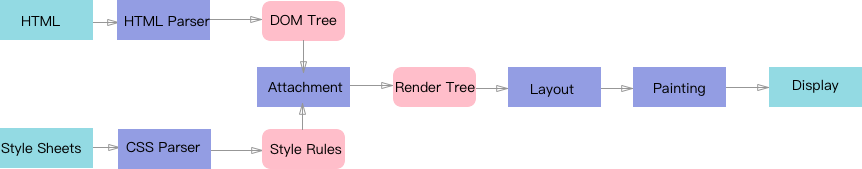

# 浏览器层与页面渲染

## 浏览器渲染步骤

解析一下上图

1. _JavaScript:_ 使用 JavaScript 来实现一些视觉效果的变化
2. _Style:_ 计算样式，根据 CSS 选择器，对每个 DOM 元素匹配对应的 CSS 样式。
3. _Layout：_ 布局前面一步知道了每个 DOM 元素的样式规则，这一步使计算每个 DOM 元素最终在品目上的大小和位置
4. _Paint:_ 绘制，本质上就是填充像素的过程，这个过程在多个层上完成
5. _Composite_ ：渲染层合并，浏览器将所有按照合理的顺序合并成一个图层，再显示到屏幕上

那么 webkit 内核的 chrome 浏览器是怎么构建的呢：

这篇文章主要是讲 `Composite`的

## 浏览器层原理

### 1. 渲染对象 RenderObject

每个 DOM 节点对应一个渲染对象，渲染对象依然维持着 DOM 树的树形结构，通过`绘制上下文 GraphicsContext` 发出必要的绘制调用来绘制 DOM 节点

### 2. 渲染层 RenderLayer （又称 PaintLayer）

这是浏览器渲染期间构建的第一个层模型，处于相同 z 轴的渲染对象都归并到同一个渲染层中，以下是创造一个层的条件：

1. 根元素 document
2. 有明确的定位属性 relative fixed sticky absolute
3. opacity < 1
4. css filter
5. css mask
6. mix-blend-mode 属性且不为 normal
7. transform 不为 none
8. backface-visibility 属性为 hidden
9. 有 CSS reflection 属性
10. 有 CSS column-count 属性且值不为 auto 或者有 CSS column-width 属性且值不为 auto
11. opacity、transform、fliter、backdrop-filter
12. overflow 不为 visible

RenderObjects 保持了树结构，一个 RenderObjects 知道如何绘制一个 node 的内容， 他通过向一个绘图上下文（GraphicsContext）发出必要的绘制调用来绘制 nodes。

### 3. 图形层 GraphicsLayer

GraphicsLayer 其实是要给负责生成最终准备呈现的内容图形的层模型，它拥有一个图形上下文（GraphicsContext），which 负责输出该图的位图。位图存储在共享内存中，作为纹理传到 GPU 上，最后 GPU 将多个位图进行合成，然后绘制到屏幕上。

**渲染层跟图形层的区别**：

- RenderLayers 渲染层，这是负责对应 DOM 子树
- GraphicsLayers 图形层，这是负责对应 RenderLayers 子树。

**but！！**
某些特殊的`渲染层`会被认为是**合成层 Compositing Layers**，合成层拥有单独的 GraphicsLayer，而其他不是合成层的渲染层，则和其第一个拥有 GraphicsLayer 父层公用一个。

下面是渲染层提升被认为是合成层的条件：

> 渲染层提升成合成层的先决条件是 SelfPaintLayer

- 3D transforms：translate3d、translateZ 等
- video、canvas、iframe 等元素
- 通过 Element.animate() 实现的 opacity 动画转换
- 通过 СSS 动画实现的 opacity 动画转换
- position: fixed
- 具有 will-change 属性
- 对 opacity、transform、fliter、backdropfilter 应用了 animation 或者 transition

### 合成层

除此之外，在浏览器的 Composite 阶段，还存在一种隐式合成，部分渲染层在一些特定场景下，会被默认提升为合成层。

对于隐式合成，CSS GPU Animation 中是这么描述的：

> This is called implicit compositing: One or more non-composited elements that should appear above a composited one in the stacking order are promoted to composite layers.

大概意思就是：一个或多个非合成元素应出现在堆叠顺序上的合成元素之上，被提升到合成层，即被绘制成分离的图像，然后将图像交给 GPU 处理。

## 层爆炸和层渲染

### 层爆炸

很好理解，不符合预期的合成层达到一定量级的时候，就会形成层爆炸。

会造成什么：

**层爆炸会占用 GPU 和大量的内存资源，严重损耗页面性能**

**解决层爆炸的问题**，最佳方案是打破 overlap 的条件，也就是说让其他元素不要和合成层元素重叠，譬如巧妙的使用 z-index 属性。

### 层压缩

由于重叠的原因，可能随随便便就会产生出大量合成层来，而每个合成层都要消耗 CPU 和内存资源，严重影响页面性能，所以有了层压缩。如果多个渲染层同一个合成层重叠时，这些渲染层会被压缩到一个 GraphicsLayer 中，以防止由于重叠原因导致可能出现的“层爆炸”。

举个例子：

- 有四个 absolute 定位的 div 在屏幕内发生了交叠。此时处于最下方的 div 在加上了 CSS 属性 transform: translateZ(0) 后被浏览器提升为合成层，如果按照隐式合成的原理，盖在它上边的 div 会提升为一个新的合成层，第三个 div 又盖在了第二个上，自然也会被提升为合成层，第四个也同理。这样一来，岂不是就会产生四个合成层了？

- 然而事实并不是这样的，浏览器的层压缩机制，会将隐式合成的多个渲染层压缩到同一个 GraphicsLayer 中进行渲染，也就是说，上方的三个 div 最终会处于同一个合成层中，这就是浏览器的层压缩。

但是，不是所有情况都可以进行层压缩的，这些无法进行层压缩的可能就会导致层爆炸，以下情况需要避免

- 无法进行会打破渲染顺序的压缩
- video 元素的渲染层无法被压缩同时也无法将别的渲染层压缩到 video 所在的合成层上
- iframe、plugin 的渲染层无法被压缩同时也无法将别的渲染层压缩到其所在的合成层上
- 无法压缩有 reflection 属性的渲染层（squashingReflectionDisallowed）
- 无法压缩有 blend mode 属性的渲染层（squashingBlendingDisallowed）
- 当渲染层同合成层有不同的裁剪容器（clipping container）时，该渲染层无法压缩（squashingClippingContainerMismatch）
- 相对于合成层滚动的渲染层无法被压缩（scrollsWithRespectToSquashingLayer）
- 当渲染层同合成层有不同的具有 opacity 的祖先层（一个设置了 opacity 且小于 1，一个没有设置 opacity，也算是不同）时，该渲染层无法压缩（squashingOpacityAncestorMismatch，同 squashingClippingContainerMismatch）
- 当渲染层同合成层有不同的具有 transform 的祖先层时，该渲染层无法压缩（squashingTransformAncestorMismatch，同上）
- 当渲染层同合成层有不同的具有 filter 的祖先层时，该渲染层无法压缩（squashingFilterAncestorMismatch，同上）
- 覆盖的合成层正在运行动画时，该渲染层无法压缩（squashingLayerIsAnimating），当动画未开始或者运行完毕以后，该渲染层才可以被压缩

## 性能优化

### GPU 渲染的优劣势

#### 先来了解 GPU 的工作原理

- 将每个复合层绘制成一个单独的图像；
- 准备层数据（尺寸、偏移量、透明度等）；
- 准备动画着色器（如果适用）；
- 将数据发送到 GPU；

#### GPU 跟 CPU 的关系

- CPU 计算好内容提交给 GPU
- GPU 渲染完成后将渲染结果放入**帧缓冲区**
- 视频控制器会按照 VSync 信号逐行读取帧缓冲区的数据，经过可能的数模转换传递给显示器显示

#### PROS

- 动画快速流畅，每秒 60 帧
- 在单独的线程工作，不会阻塞 js 主线程，著需要 repaint 本身
- 3D 转换消耗少

### CONS

- 需要额外的**重绘**将元素提升称复合层的时候会耗时
- 绘制的图层必须转移到 GPU，根据层的数量和大小可能传输会非常慢
- 每个复合层都占用额外的内存，这对移动端来说是个挺大的消耗
- 在 Safari 中的文本呈现可能会导致页面内容消失或变形

### 优化建议

- 避免隐形合成
  - 可以把那些动画什么的`z-index`设置成大一点
- 动画使用 transform 和 opacity 属性
- 减少复合层尺寸
- 减少绘制区域

## 参考文章

1. [详谈层合成](https://juejin.cn/post/6844903502678867981)
2. [淘系-无限性能优化：Compositte](https://fed.taobao.org/blog/2016/04/26/performance-composite/)
3. [CSS GPU Animation](https://www.smashingmagazine.com/2016/12/gpu-animation-doing-it-right/)
4. [浏览器层-掘金](https://juejin.cn/post/6844903959425974280#heading-20)
