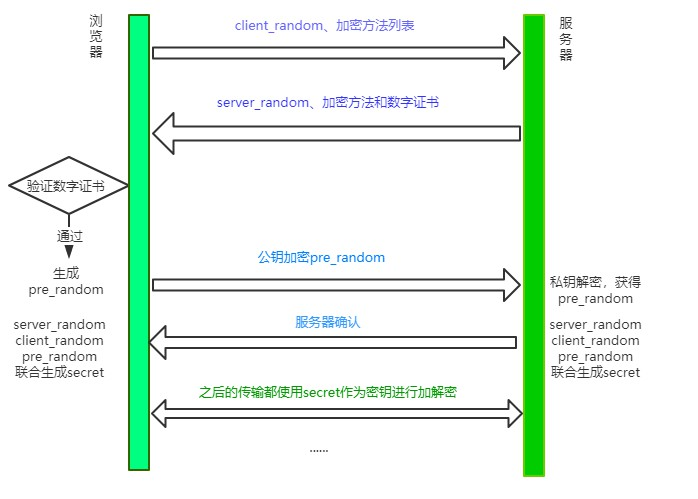

### 对称加密和非对称加密

==对称加密== 是最简单的方式，指的是加密和解密用的是==同样的密钥== 。

而对于非对称加密，如果有 A、 B 两把密钥，如果用 A 加密过的数据包只能用 B 解密，反之，如果用 B 加密过的数据包只能用 A 解密

#### 对称加密

- 浏览器给服务端发送一个随机数 ==client_random== 和一个加密的方法列表
- 服务器接收后给浏览器返回另一个随机数 ==server_random== 和加密方法
- 然后用这个 ==加密方法== 将两个随机数混合起来生成密钥

#### 非对称加密

- 浏览器把==client_random== 和加密方法列表传过来，服务器接收到，把 server_random、加密方法和==公钥== 传给浏览器。
- 当两者都有相同的 ==client_random==、==server_random==、和==加密方法== ,浏览器用 ==公钥== 将 ==client_random== 和 ==server_random== 加密，生成服务器通信的 ==暗号== 。

##### 公钥加密的数据可以用私钥解密，那私钥加密的数据也可以用公钥解密呀！

### 两者结合

1. 浏览器向服务端发送 client_random 和加密方法列表
2. 服务器收到，返回 server_random,加密方法和公钥
3. **浏览器接收，生成另一个随机数 ==pre_random== ,并且用公钥加密，传给服务器**
4. 服务器用==私钥== 解密这个加密后的 ==pre_random==。

## 数字证书验证过程

首先，会读取证书中的明文内容。CA 进行数字证书的签名时会保存一个 Hash 函数，来这个函数来计算明文内容得到信息 A，然后用公钥解密明文内容得到信息 B，两份信息做比对，一致则表示认证合法。

当然有时候对于浏览器而言，它不知道哪些 CA 是值得信任的，因此会继续查找 CA 的上级 CA，以同样的信息比对方式验证上级 CA 的合法性。一般根级的 CA 会内置在操作系统当中，当然如果向上找没有找到根级的 CA，那么将被视为不合法。

