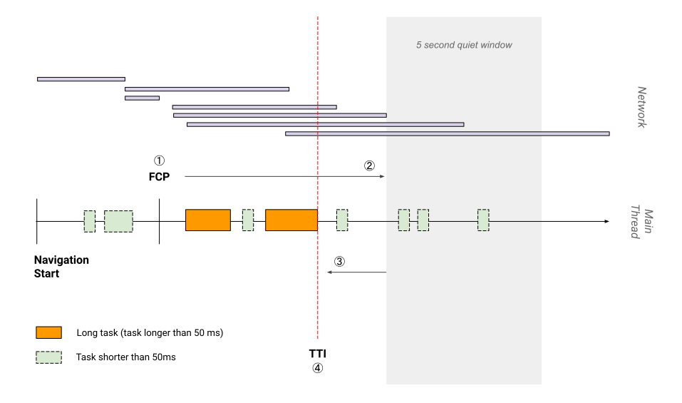

参考链接：

1. https://web.dev/
2. https://mp.weixin.qq.com/s/NYqdeQm5tnQZ1NrgL9vsJQ

## LCP The largest contentful Paint

### Definition

Reports the render time of the largest image or text block visible within the viewport, relative to when the page first started loading.
Docuements:
https://aoimonotw.blogspot.com/2020/05/chrome-ux.html

### How to know it

> performance - timings - LCP

### What is a good LCP score

To provide a good user experience, sites should strive to have Largest Contentful Paint of ` 2.5 seconds or less`. To ensure you're hitting this targetfot moust of your users, a good threshold to measure is the 75th percentile of page loads, segmented across mobile and desktop devices. `More than 4.0s is not good`

### What element will change the LCP

Only the element's initial size and position in the viewport is considered

## FID First Input Delay

### Definitionb

A user-centric metric for measuring load responsiveness for it quantifies the experience users feel when trying to interact with unresponsive pages —— a load FID ensure that the page is usable.

It measures the time from when a user first **interacts with a page** to then time when then browser is actually able to begin **processing event handles in response** to theat intaraction.

In short, the first Input Delay metric helps measures your user's first impression of your site's interactivity and responsivenss.

### what is a good FID score

Sites should strive to have a First Input Delay of 100 milliseconds or less. A good threshold to measure is the 75th persentile of page loads, segmented across mobile and desktop devices.

`100 ms or less`

### What makes it delay

The browser is busy parsing and executing a large JS file loaded by yout app

### more

- **FCP First Contentfule Paint**
- **Time to Interactiive**
  

### why only consider the first input

- To make a good impression
- The biggest interactivity issues we see on the web today occur during page load

### What counts as a first input

click ,taps, key pressss

### Something protect the FID

The developer sometimes would wrap their event handler logic in an asynchronous callback (`setTimeout()` or `requestAnimationFrame()`) in order to separate it from the task assocaited with the event. The result would be an improvement in the metric score but a lower response as percervied by the uesr.

## CLS Cumulative Layout Shift

> A user-centric for measuring visual stability

### Definition

CLS measures the sum total of all individual layout shift for wcery unexpected leyout shift that occurs during the entire lifespan of the page.

### Good CLD score

`The CLS score of 0.1 or less ` , `more than 0.25 is not good`

### Layout shift score

> layout shift score = impact fraction \* distance franction

For example for first

#### impact fraction

In this image above there's an element that takes up half of the viewport in one frame. Then, in the next frame, the elemnt shift down by 25% of viewport height. The red, dotted rectangle indicated the union of hte element's visible area in both frames, which, in this case, is 75% of the total viewport, so its `impact fraction `is 0.75

#### Distance fraction

In this image, the largest viewport dimension is the heiht, and the unstable element has moved by 25% of the viewport hright, which makes the `distance frantion` 0.5

the layout shift score is `0.75 * 0.25 = 0.1875`

### Animation and transitionws

CSS transform property allows you to animate elelemnts without triggering layout shift:

- Instead of changing the height and widht properties, use `transform:scale()`
- To move element around, avoid changing the top, right, bottom, or left properties and use `transform: translate()` instead

### How to improve CLS

- Always include size attributes on your images and video elements, or otherwise reverse the required space with somthing like CSS aspect ratio boxes. This approach ensures that the browser can allocate the correct amount of space in the document while the image is loading. Note that you can also use the unsized-media feature policy to force this behavior in browsers that support feature policies.
- Never insert content above existing context , except in response to a user interaction. This exsure any layout shifts that occur are expected.
- Prefer transform animations to animaitions of properties that trigger layout changes. Animate transition in a way that provides context and continuity from state to state.

## TTFB Time to first byte

### Definition

The time to load the first byte in the site.

### Improve it

- Optimize the server's application login to prepare pages faster. If you use a server framwork, the framwork may hava recommendations on how to do this.
- Optimize how your server queries databases, or migate to faster database systems.
- Upgrade your server hardware to have more memory or CPU.

## FCP First Contentfule Paint

> LCP Largest Contentful Paint is diffirent

### Improve Way

- Eliminate render-blocking resources
- Minify CSS
- Remove unused CSS
- Preconnect to requied origin
- Avoid multiple page redirects
- Preload key requests
- Avoid enormous network payloads
- Serve static assets with efficient cache policy
- Avoid an excessive DOM size
- Minimize critical request depth
- Ensure text remains visible during webfonr load
- keep request counts low and transfer sizes small

## TTI Time to Interactive

### CAlculate TTI

1. Start at First Contentful Paint (FCP).
2. Search forward in time for a quiet window of at least five seconds, where quiet window is defined as: no long tasks and no more than two in-flight network GET requests.
3. Search backwards for the last long task before the quiet window, stopping at FCP if no long tasks are found.
4. TTI is the end time of the last long task before the quiet window (or the same value as FCP if no long tasks are found).

### Improve

- Minify JavaScript
- Preconnect to required origins
- Preload key requests
- Reduce the impact of third-party code
- Minimize critical request depth
- Reduce JavaScript execution time
- Minimize main thread work
- Keep request counts low and transfer sizes small
