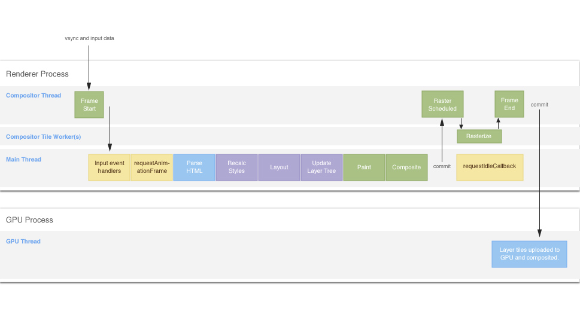

## 总结前言：

- js 执行线程是**单线程**。react 在进行组件渲染的时候，从 setState 开始到渲染完成整个过程是同步的。如果渲染的组件很大，JS 的单线程执行就会**占据主线程事件比较长**
- 16 的一大特色就是**时间切片功能**。把一条路走到底的任务通过时间切片分为多个切片间断执行，使得执行的期间浏览器可以进行操作响应,从而提高页面渲染性能和用户体验。
- 本质是使用**链表来串联父子节点以及兄弟节点来达到状态中断以及状态恢复**的功能

## 实现原理

Fiber 有自己的组件调用栈，以`链表`的形式遍历组件树，可以`灵活地暂停、继续和丢弃执行地任务`,通过串联父子节点以及兄弟节点来达到状态中断以及状态恢复。其实是利用了 `requestIdleCallback` 这个 API

## 3.24 更新

新版本的时间已经不是用 `requestIdleCallback` 了，而是用`MessageChannel`

首先 React 会默认有许多微小任务，也就是 fiber 节点

在执行调度工作和计算工作循环时，执行每一个工作中的 Fiber。但是，有一个条件是每隔 5 毫秒，会跳出工作循环，运行一次**异步的`MessageChannel`的`port.postMesage()`方法，检查是否存在事件响应、更高优先级任务及其他代码需要执行** 。如果有则执行，如果没有则`重新创建工作循环`，执行剩下的工作中的 Fiber。 但是，由于检查也会费一点时间，所以 5 毫秒有时候不会精准。

本质来说，**使用 MessageChannel 的目的就是为了产生宏任务**

```javascript
const channel = new MessageChannel();
const port = chanel.port2;

//每次port.postMassage调用就会添加一个宏任务
// 该宏任务为调用schedule.scheduleTask方法
channel.port1.onmessage = scheduler.scheduleTask;

const scheduler = {
  scheduleTask() {
    //挑选一个任务并执行
    const task = pickTask();
    const continuousTask = task();

    //如果当前任务未完成，则在下个宏任务继续执行
    if (continuousTask) {
      port.postMessage(null);
    }
  },
};
```

## 为什么不用 requestAnimationFrame 了

我们知道 rAF() 是在页面更新之前被调用。

如果第一次任务调度不是由 rAF() 触发的，例如直接执行 scheduler.scheduleTask()，那么在本次页面更新前会执行一次 rAF() 回调，该回调就是第二次任务调度。所以使用 rAF() 实现会导致在本次页面更新前执行了两次任务。

为什么是两次，而不是三次、四次？

因为在 rAF() 的回调中再次调用 rAF()，会将第二次 rAF() 的回调放到下一帧前执行，而不是在当前帧前执行。
另一个原因是 rAF() 的触发间隔时间不确定，如果浏览器间隔了 10ms 才更新页面，那么这 10ms 就浪费了。

## React 和 Schedule 交互

1. React 组件状态更新，向 schedule 中存入一个任务，该任务为 React 更新算法
2. Schedule 调度该任务，执行 React 更新算法
3. React 在调和阶段更新一个 Fiber 之后，会询问 Schedule 是否需要暂停。如果不需要暂停，就重复步骤 3，继续更新下一个 Fiber
4. 如果 Schedule 表示需要暂停，则 React 将返回一个函数，which 用于告诉喊出 Schedule 任务还没完成，sChedule 将在未来某时刻调度任务。

伪代码如下

```javascript
const scheduler = {
  pushTask() {
    // 1. 存入任务
  },

  scheduleTask() {
    // 2. 挑选一个任务并执行
    const task = pickTask();
    const hasMoreTask = task();

    if (hasMoreTask) {
      // 4. 未来继续调度
    }
  },

  shouldYield() {
    // 3. 由调用方调用，调用方判断是否需要暂停
  },
};

// 当用户点击时修改了组件状态，则伪代码如下
const handleClick = () => {
  // React 组件更新时，产生任务
  const task = () => {
    const fiber = root;
    while (!scheduler.shouldYield() && fiber) {
      // reconciliation() 对当前的 fiber 执行调和阶段
      // 并返回下一个 fiber
      fiber = reconciliation(fiber);
    }
  };

  scheduler.pushTask(task);

  // React 会在将来某个时间执行 scheduler.scheduleTask()
  // 这里假设立即执行 scheduler.scheduleTask()
  scheduler.scheduleTask();
};
```

## 中断什么 怎么中断

> 终端机制主要由硬件出发，CPU 属于被动接受

### 先来看用户 input 之后发生什么



1. 输入事件处理
2. requestAnimationFrame
3. DOM 渲染
4. RequestCallback：_这个用来模拟中断_ 通过主动释放时机，达到不阻塞浏览器的渲染和响应的目的

```javascript
function task(deadline) {
  while (true) {
    if (!deadline.timeRemaining()) {
      requestIdleCallback(task);
      break;
    }
  }
}
requestIdleCallback(task);
```

以下是`React fiber`主动释放的代码

```javascript
function workloop(hasTimeRemaining, initialTime) {
  let currentTime = initialTime;
  advanceTimers(currentTime);
  currentTask = peek(taskQueue);
  while (
    currentTask !== null &&
    !(enableSchedulerDebugger && isSchedulerPaused)
  ) {
    if (
      currentTask.expirationTime > currentTime &&
      (!hasTimeRemaining || shouldYieldToHost())
    ) {
      //超时的话就主动退出循环，将控制权交还浏览器
      break;
    }
  }
}
```

## 接下来看 react 如何调度一个任务

### 初始化

1. 当出现新的更新时，React 会运行一个确保 root 被安排任务的函数

2. 当 root 的`回调函数为空值且新的更新对应的过期时间标记是异步类型`时，根据当前时间和过期时间标记推断出`优先级和timeout`，然后根据优先级、timeout， 解和执行工作的回调函数，执行一个任务，将该任务放入任务队列中，调用 DOM 调度配置文件中的`requestHostCallback`，回调函数为调度中心的清空任务方法

### 运行任务

1. `requestHostCallback`调用`MessageChannel`中的异步函数:`port.postMessage()`，从而异步执行之前另一个端口`port1`订阅的方法，在该方法中，执行 requestIdCallback 的回调函数，即调度中心的清空任务方法

2. 清空任务方法中，会执行调度中心的工作循环，循环执行任务队列中的任务

3. 任务的回调函数是一个执行同时模式下 root 工作的方法。执行该方法时将循环执行工作中 fiber，同样使用 5 毫秒左右的时间切片进行计算和 diff，5 毫秒时间切片过期后就会返回其自身

### 完成任务

1. 在执行完所有工作中 fiber 后，react 进入提交步骤，更新 DOM

2. 任务的回调函数返回空值，调度工作循环，完成此任务，并将此任务从任务队列中删除

## react 内部运转分三层

1. Vitual DOM 层，描述页面长什么样
2. Reconciler 层，负责调用组件生命周期方法、Diff 运算等（Fiber）
3. Renderer 层，根据不同的平台，渲染出相应的页面，比较常见的是 reactDOM 和 ReactNative

`Scheduler`用来做任务分配：

- synchronous，与之前的 Stack Reconciler 操作一样，同步执行
- task，在 nextTick 之前执行
- animation，下一帧之前执行
- high，不久将来
- low，稍微延迟执行
- offscreen 下一次 render 时或 scoll 时执行

- Fiber Reconciler（react）执行阶段：

  - 阶段一，生成 Fiber 树，得出需要更新的节点信息。这一步是一个渐进的过程，可以被打断
  - 阶段二，将需要更新的节点一次过批量更新，不能打断

参考文档：

1. [彻底搞懂 react 调度](https://terry-su.github.io/cn/undestand-react-scheduling-mechanism-from-source-code-concurrent-mode/)
2. [react Schedule](https://juejin.cn/post/6953804914715803678)
