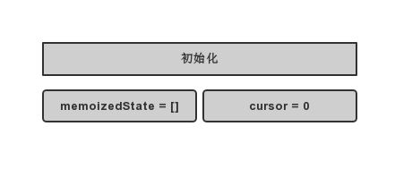

## hook 原理

### 1. 初始化



### 2.初次渲染

    每次（使用useState或者useEffect）渲染更新一次memoixedState，即维护hooks的队列，下标cursor也做相对应的更新

    可以注意到，useEffect使用的时候使用数组更新的

`const [count,setCount] = useState(0)`

`useEffect(()=>{console.log(count)},[count])`


### 3. 事件触发

每次事件触发 cursor 会重新**更新为 0**


### 4. Re Render


### 接下来可以回答相应的问题了

Q：为什么只能在函数最外层调用 Hook？为什么不要在循环、条件判断或者子函数中调用。

A：memoizedState 数组是按 hook 定义的顺序来放置数据的，如果 hook 顺序变化，memoizedState 并不会感知到。

Q：自定义的 Hook 是如何影响使用它的函数组件的？

A：共享同一个 memoizedState，共享同一个顺序。

Q：“Capture Value” 特性是如何产生的？

A：每一次 ReRender 的时候，都是重新去执行函数组件了，对于之前已经执行过的函数组件，并不会做任何操作。

### useState 和 useEffect 组合

```
let memoizedState = []; // hooks 存放在这个数组
let cursor = 0; // 当前 memoizedState 下标

function useState(initialValue) {
  memoizedState[cursor] = memoizedState[cursor] || initialValue;
  const currentCursor = cursor;
  function setState(newState) {
    memoizedState[currentCursor] = newState;
    render();
  }
  return [memoizedState[cursor++], setState]; // 返回当前 state，并把 cursor 加 1
}

function useEffect(callback, depArray) {
  const hasNoDeps = !depArray;
  const deps = memoizedState[cursor];
  const hasChangedDeps = deps
    ? !depArray.every((el, i) => el === deps[i])
    : true;
  if (hasNoDeps || hasChangedDeps) {
    callback();
    memoizedState[cursor] = depArray;
  }
  cursor++;
}
```

### 参考文章

[React hook 原理](https://github.com/brickspert/blog/issues/26)
