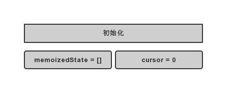
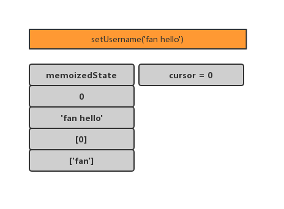
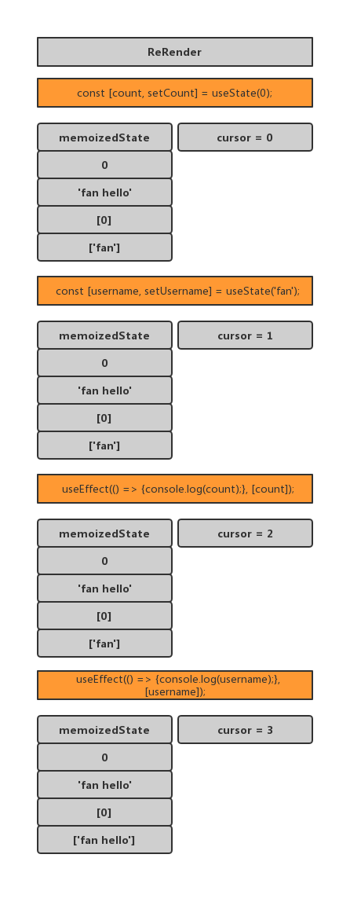

## hook 原理

### 1. 初始化



### 2.初次渲染

    每次（使用useState或者useEffect）渲染更新一次memoixedState，即维护hooks的队列，下标cursor也做相对应的更新

    可以注意到，useEffect使用的时候使用数组更新的

`const [count,setCount] = useState(0)`

`useEffect(()=>{console.log(count)},[count])`


### 3. 事件触发

每次事件触发 cursor 会重新**更新为 0**



### 4. Re Render



### 接下来可以回答相应的问题了

Q：为什么只能在函数最外层调用 Hook？为什么不要在循环、条件判断或者子函数中调用。

A：memoizedState 数组是按 hook 定义的顺序来放置数据的，如果 hook 顺序变化，memoizedState 并不会感知到。

Q：自定义的 Hook 是如何影响使用它的函数组件的？

A：共享同一个 memoizedState，共享同一个顺序。

Q：“Capture Value” 特性是如何产生的？

A：每一次 ReRender 的时候，都是重新去执行函数组件了，对于之前已经执行过的函数组件，并不会做任何操作。

### useState 和 useEffect 组合

```
let memoizedState = []; // hooks 存放在这个数组
let cursor = 0; // 当前 memoizedState 下标

function useState(initialValue) {
  memoizedState[cursor] = memoizedState[cursor] || initialValue;
  const currentCursor = cursor;
  function setState(newState) {
    memoizedState[currentCursor] = newState;
    render();
  }
  return [memoizedState[cursor++], setState]; // 返回当前 state，并把 cursor 加 1
}

function useEffect(callback, depArray) {
  const hasNoDeps = !depArray;
  const deps = memoizedState[cursor];
  const hasChangedDeps = deps
    ? !depArray.every((el, i) => el === deps[i])
    : true;
  if (hasNoDeps || hasChangedDeps) {
    callback();
    memoizedState[cursor] = depArray;
  }
  cursor++;
}
```

## 使用 hook 的动机

1. 减少状态太逻辑复用

   mixin 的状态逻辑就是可以相互覆盖的，hook 就不会

2. 避免地狱式嵌套
   hoc 的地狱式嵌套会非常深

3. 让组件更容易理解

他们拥有自己的各种状态，然后将组件分割成更小的各种更小的函数

4. 使用函数代替 class

class 比函数好用

## 闭包陷阱

我们知道 hooks 的原理是有闭包的，memoizedState 数组是按 hook 定义的顺序来放置数据的，如果 hook 顺序变化，memoizedState 并不会感知到，所以 react 是通过判断以来是否有改变，改变了才会执行回调函数，我们来看下面的代码

```javascript
function Demo() {
  const [count, setCount] = useState(0);

  useEffect(() => {
    let timer = setInterval(function () {
      console.log(`Count is: ${count}`);
      setCount(count + 1);
    }, 1000);
    console.log(timer);
    return () => {
      clearInterval(timer);
    };
  }, []);

  return <p>{count}</p>;
}
```

上述三个 Hook 创建出来的闭包所包含的变量是创建该闭包时的变量值，不受后续该变量变化的影响。又因为我们给 useEffect 指定的依赖项是空的，所以 useEffect 只会在页面第一次加载时执行而已，即定时器的闭包只创建了一次。所以这就造成了每次都是打印 Count is: 0，并且因为闭包中的 count 保持了初始值 0，所以 setCount 执行的一直是 setCount(0+1)，于是页面显示的 count 值就一直是 1 了。

### 闭包陷阱解决办法

### 添加依赖项

Hook 中的闭包问题主要是因为我们没有在 Hook 中添加依赖项，导致闭包没有更新始终保持着初始值。所以我们只要给 useEffect 指定 count 这个依赖，则每当依赖项改变时都会重新生成一个新的闭包，而新闭包保存的 count 值也就随着自然更新了。
当然直接去掉依赖项（不传 useEffect 的第二个参数）也是可以解决闭包过时问题

### 以函数形式更新 State

以函数的形式更新 state，同 react 的 setState 一样，useState Hook 也可以通过函数的形式来修改 state，并且使用当前的 state 值作为函数参数。这样打印出来的 count 值虽然依旧是闭包初始化时保存的 0，但 count 不再是在它的初始值上更新，而是在当前 count 值的基础上更新的，所以页面显示的 count 能保持一个新的值。

```javascript
// 以函数的形式更新state
setCount((curCount) => curCount + 1);
```

### 使用 useRef

绑定在对象上

### 使用 useReducer

useReducer 可以达到和使用函数形式更新的 useState 一样的效果，也是在更新时在当前的 state 基础上进行操作。

```javascript
function reducer(count, action) {
  switch (action.type) {
    case "add":
      return count + action.gap;
    default:
      return count;
  }
}

function Demo() {
  const [count, dispatch] = useReducer(reducer, 0);

  useEffect(() => {
    let timer = setInterval(function () {
      dispatch({ type: "add", gap: 10 });
    }, 1000);
    return () => {
      clearInterval(timer);
    };
  }, []);

  return <p>{count}</p>;
}
```

### 参考文章

[React hook 原理](https://github.com/brickspert/blog/issues/26)
[react about hoc 等组件服用](https://juejin.cn/post/6844903815762673671#heading-33)
[轻松掌握 React Hooks 底层原理](https://segmentfault.com/a/1190000038768433)
[闭包陷阱](http://blog.dangosky.com/2019/11/16/React-Hook-%E4%B8%AD%E7%9A%84%E9%97%AD%E5%8C%85%E9%99%B7%E9%98%B1/)
