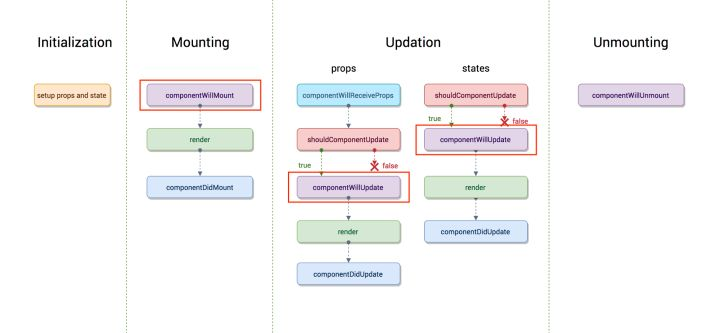

参考：

https://www.runoob.com/react/react-component-life-cycle.html
https://juejin.cn/post/6845166891711856654
https://www.cnblogs.com/WindrunnerMax/p/14090262.html
https://segmentfault.com/a/1190000020348448

## 先看图

#### 旧的生命周期

## 主要分为三个阶段

### Mounting 挂载阶段

**constructor()** > 加载的时候调用，可以初始化 state

**static getDerivedStateFromProps(props, state)** > 组件每次被 rerender 的时候，包括在组件构建之后(虚拟 dom 之后，实际 dom 挂载之前)，每次获取新的 props 或 state 之后；每次接收新的 props 之后都会返回一个对象作为新的 state，返回 null 则说明不需要更新 state；配合 componentDidUpdate，可以覆盖 componentWillReceiveProps 的所有用法

**getDefaultProps()** > 设置默认的`props`，也可以用 defaultProps 设置组件的默认属性

**getInitialState** > 初始化 state，可以直接 constructor 中定义 this.state

**componentWillMount** > 组件加载时调用，以后不会调用，整个生命周期调用一次，可以修改 state

**render** > 创建虚拟 DOM，进行 DIFF 算法，更新 dom 树都在这里进行

**componentDidMount** > 组件渲染之后调用，只调用一次

### Updating 更新阶段

**componentWillReceiveProps** > 组件加载时步调用，组件接受新的 props 时调用

**shouldComponentUpdate** > 组件接受到`新的props或者state`调用，`return false`能阻止更新

**static getDerivedStateFromProps(props,state)** > 组件每次 rerender 的时候，包括组件构建之后（虚拟 dom 之后，实际 dom 挂载之前），每次获取新的 props 或 state 之后，每次接受新的 props 之后都会返回一个对象作为新的 state，返回 null 则说明不需要更新 state；配合 componentDidUpdate，可以覆盖 componentWillReceiveProps 的所有用法

**getSnapshotBeforeUpdate** > 发生在 update 发生的时候，在 render 之后，在组件 dom 渲染之前；返回一个值，作为 componentDidUpdate 的第三个参数；配合 componentDidUpdate，可以覆盖 componentWillUpdate 的所有用法

**componentWillUpdate** > 组件加载时步调用，只有在组件将要更新时才会调用

**render** > 更新阶段也会更新噢

**componentDidUpdate** > 组件加载时不调用，组件更新完成后调用
