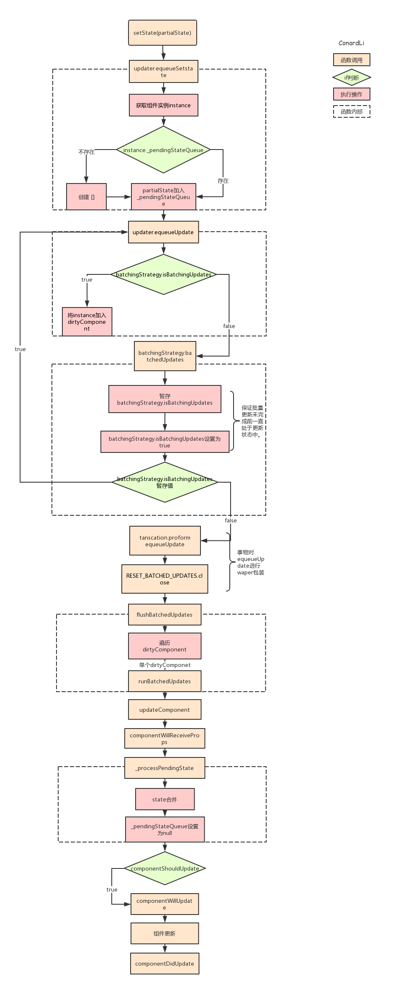

# setState 原理

## setState 执行过程

### 1. 流程图



分析一下流程：

1. `partialState`:`setState`传入的第一个参数，对象或者函数
2. `_pendingStateQueue` :当前组件等待执行的`state`队列
3. `isBatchingUpdate`:react 用于表示当前是否处于批量更新状态，所有组件公用
4. `dirtyComponent`:当前所有处于待更新状态的组件队列
5. `transcation`:react 的十五机制，在被十五调用的方法外包装 n 个`wraper`对象，并依次执行：`waper.init`、被调用方法、`waper.close`
6. `FLUSH_BATCHED_UPDATES`：用于执行更新的`waper`，只有一个 close 方法


### 2. 执行过程

1. 在 `setState` 的时候，React 会为当前节点创建一个 `updateQueue` 的更新列队。
2. 然后会触发 `reconciliation` 过程，在这个过程中，会使用名为 `Fiber` 的调度算法，开始生成新的 Fiber 树， Fiber 算法的最大特点是可以做到`异步可中断的执行`。
3. 然后 `React Scheduler` 会根据优先级高低，先执行优先级高的节点，具体是执行 `doWork` 方法。
4. 在 `doWork` 方法中，React 会执行一遍 `updateQueue` 中的方法，以获得新的节点。然后对比新旧节点，为老节点打上 更新、插入、替换 等 Tag。
5. 当前节点 doWork 完成后，会执行 `performUnitOfWork` 方法获得`新节点`，然后再重复上面的过程。
6. 当所有节点都 doWork 完成后，会触发 commitRoot 方法，React 进入 `commit` 阶段。
7. 在 `commit` 阶段中，React 会根据前面为各个节点打的 Tag，一次性更新整个 dom 元素。

### 是异步还是同步的呢

> 默认react内部代码执行到performWork 、performWorkOnRoot、performSyncWork、performAsyncWork这四个方法的时候，就是react去update更新并且作用到UI上。

- 合成事件中是异步
- 钩子函数中的是异步
- 原生事件中是同步 
  - 原生事件的调用栈就比较简单了，因为没有走合成事件的那一大堆，直接触发click事件，到 requestWork ,在requestWork里由于 expirationTime === Sync 的原因，直接走了 performSyncWork 去更新，并不像合成事件或钩子函数中被return，所以当你在原生事件中setState后，能同步拿到更新后的state值。
- setTimeout中是同步
```javascript
class App extends Component {

  state = { val: 0 }

  batchUpdates = () => {
    this.setState({ val: this.state.val + 1 })
    this.setState({ val: this.state.val + 1 })
    this.setState({ val: this.state.val + 1 })
 }

  render() {
    return (
      <div onClick={this.batchUpdates}>
        {`Counter is ${this.state.val}`} // 1
      </div>
    )
  }
}

```
  - 在 setState 的时候react内部会创建一个 updateQueue ，通过 firstUpdate 、 lastUpdate 、 lastUpdate.next 去维护一个更新的队列，在最终的 performWork 中，相同的key会被覆盖，只会对最后一次的 setState 进行更新，下面是部分实现


### 总结

### 参考文章

1. https://juejin.cn/post/6844903781813993486
2. https://juejin.cn/post/6844903636749778958
3. https://zhuanlan.zhihu.com/p/304213203
